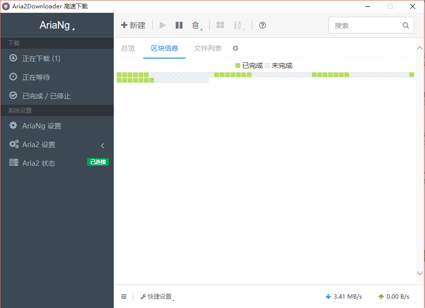

# Aria2Downloader 高速下载
Aria2Downloader 是一个轻量级多协议和多源下载实用工具。它支持 HTTP / HTTPS, FTP, SFTP, bt 和 Metalink。

## 如何下载
- 方法1：通过 百度云下载
- 方法2：通过 Github 的 Releases 下载

## 功能特征
- 开箱即用，免安装，不需要敲命令行和打开其他网站
- 多协议支持，多脚本/扩展，完全免费，可定制型极强
- Windows 平台定制开发，不仅占用小，存储空间也小

## 软件截图

## 开发文档
- [依赖软件](./doc/credits.md)
- [开发文档](./doc/dev.md)

## 许可证信息

Aria2Downloader 的诞生离不开 Aria2c 开源项目以及其他[开源软件](./doc/credits.md)。

Code released under the GPL-2.0 License.
